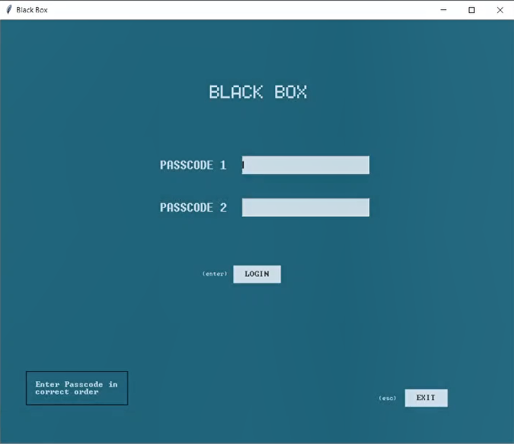
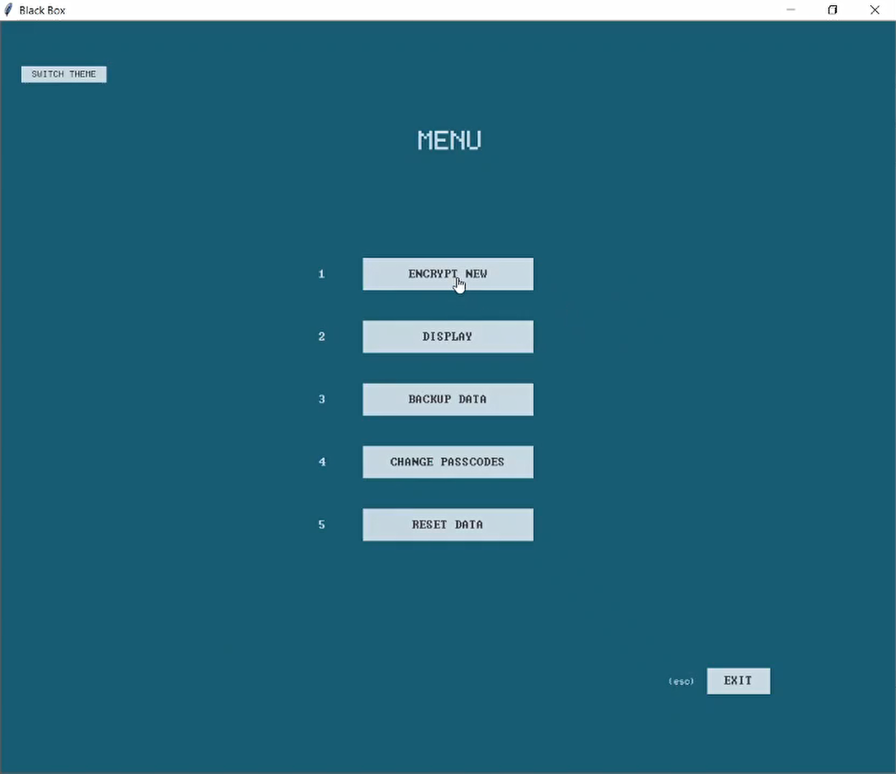
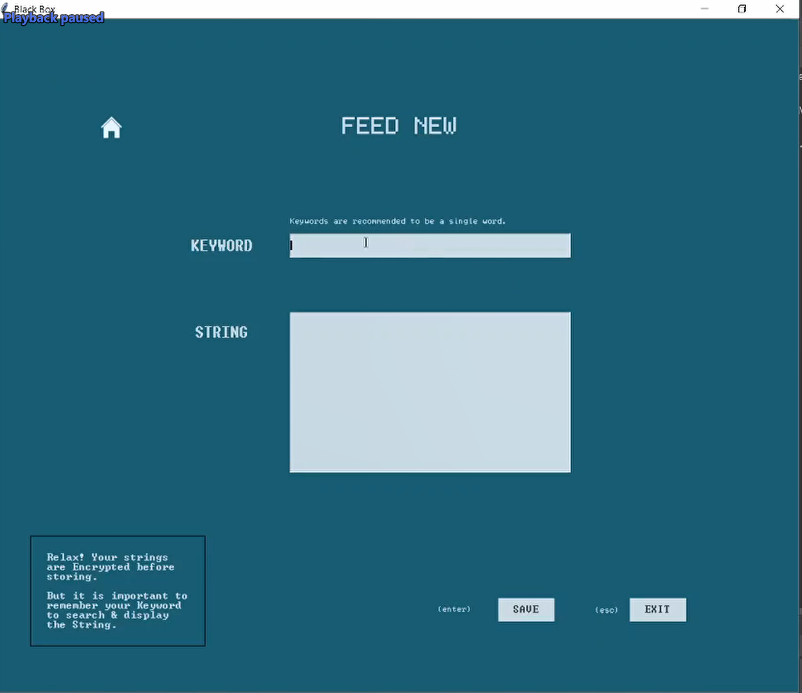
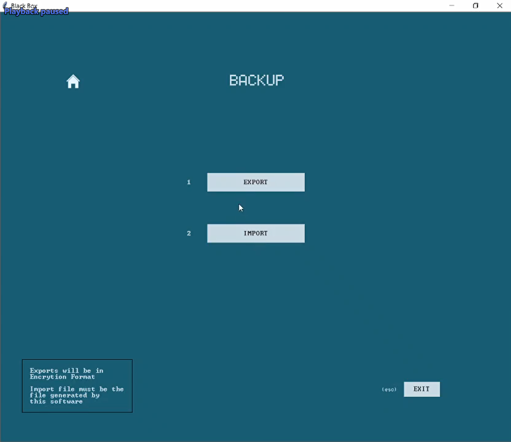
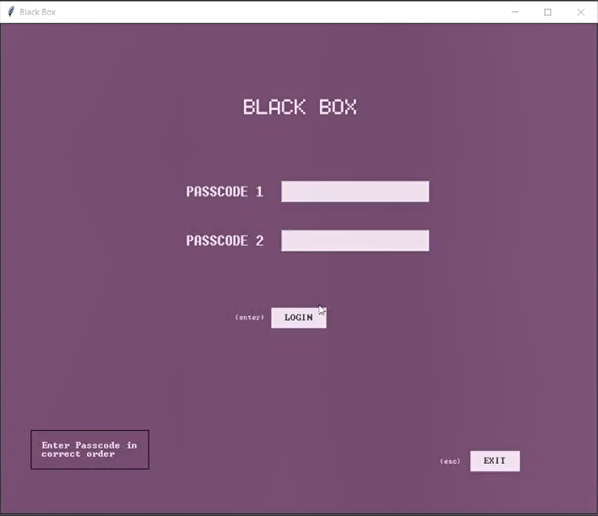
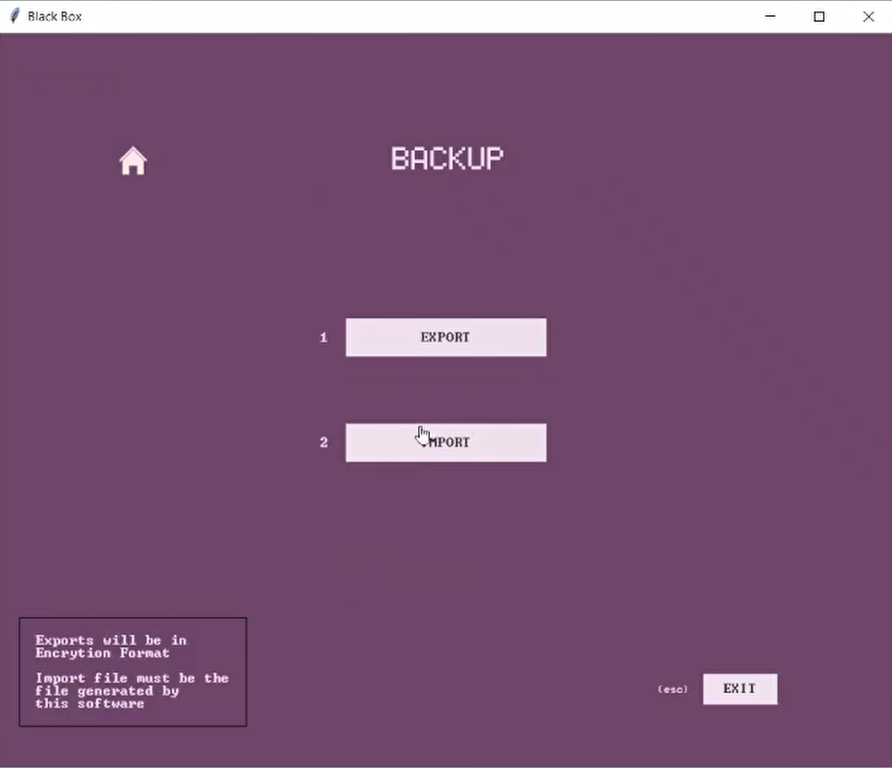

# BLACK BOX - Password Manager

###### BACKGROUND STORY
I always had a hard time remembering all my passwords. There are many solution tools available online, however, I never trusted third party softwares for such purposes. So, I decided to build my own password manager tool called “Black Box” to save encrypted passwords locally on my system.

This is only the UI. The backend is under development.
###### FUTURE PLANS
Host the application on a home NAS network and create a personal mobile application to fetch passwords when away. 
## DEMO
Keep an eye for updates if any @ [Youtube](https://www.youtube.com/channel/UCevdb-ICQGDpyDTzo8-xK8Q) 

## SCREENSHOTS

